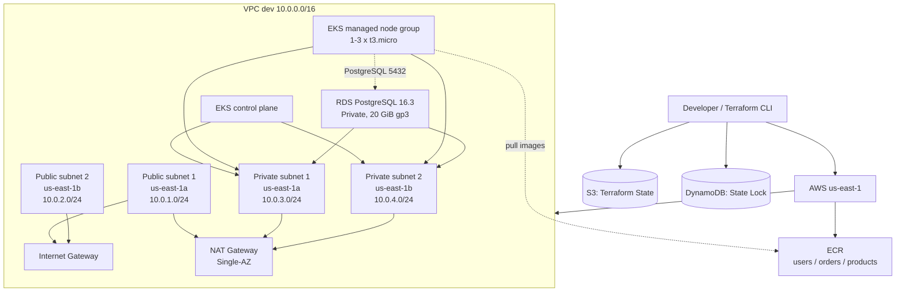

# AWS infrastructure for Kubernetes microservices

Infrastructure as code for a `dev` environment running microservices on Amazon EKS. The project provisions the network, image repositories, Kubernetes cluster, and managed PostgreSQL database through reusable Terraform modules.

## Current status

The current implementation contains:

- A VPC in `us-east-1` with CIDR `10.0.0.0/16`.
- Two public and two private subnets distributed across `us-east-1a` and `us-east-1b`.
- An Internet Gateway for the public subnets.
- A NAT Gateway in the first public subnet for Internet egress from the private subnets.
- Three private Amazon ECR repositories for microservice images:
	- `dev-users-service`
	- `dev-orders-service`
	- `dev-products-service`
- An Amazon EKS cluster named `dev-eks-cluster`, version `1.36`.
- An EKS managed node group using `t3.micro` instances, on-demand capacity, and scaling from 1 to 3 nodes, with 2 desired nodes.
- A private Amazon RDS PostgreSQL 16.3 instance with 20 GiB of `gp3` storage.
- A remote Terraform backend in S3 with DynamoDB locking.

The infrastructure foundation is ready to host microservices, but this repository does not yet include Kubernetes manifests, Helm charts, application images, a CI/CD pipeline, an application load balancer, or observability configuration.

## Architecture



### Network flow

1. Public subnets have a default route to the Internet Gateway and assign public IPs when instances are created.
2. Private subnets do not receive public IPs. Their default route points to the NAT Gateway in `public_subnet_1`.
3. The EKS control plane and nodes are associated with the private subnets.
4. RDS uses the private subnets and is not publicly accessible.
5. The RDS security group allows TCP/5432 only from the VPC CIDR (`10.0.0.0/16`).

### Application deployment flow

The infrastructure enables the following flow, although application deployment automation still needs to be added:

```text
Microservice source code -> Docker build -> ECR -> EKS -> RDS PostgreSQL
```

The EKS nodes have the `AmazonEC2ContainerRegistryReadOnly` policy attached, so they can pull images from ECR. Applications should receive the RDS endpoint and credentials through Kubernetes Secrets, AWS Secrets Manager, or an equivalent mechanism; credentials must not be included in versioned manifests.

## Implemented components

| Module | Main resources | Integration |
| --- | --- | --- |
| `vpc` | VPC, 4 subnets, Internet Gateway, NAT Gateway, route tables and associations, Elastic IP | Exposes the VPC ID and public/private subnet IDs |
| `ecr` | Three ECR repositories with immutable tags and scan-on-push | Exposes repository URLs and ARNs |
| `eks` | IAM roles, EKS cluster, and managed node group | Consumes private subnets from `vpc` |
| `rds` | DB subnet group, security group, and PostgreSQL instance | Consumes the VPC and private subnets from `vpc` |

### ECR

The repositories are created with:

- `image_tag_mutability = "IMMUTABLE"`, preventing an existing tag from being overwritten.
- `scan_on_push = true`, starting a vulnerability scan when an image is pushed.
- Environment-prefixed names: `dev-users-service`, `dev-orders-service`, and `dev-products-service`.

### EKS and IAM

The cluster uses a control plane role with `AmazonEKSClusterPolicy`. The node group uses a separate role with:

- `AmazonEKSWorkerNodePolicy`.
- `AmazonEKS_CNI_Policy`.
- `AmazonEC2ContainerRegistryReadOnly`.

The cluster and nodes are deployed in the private subnets. The node group uses `ON_DEMAND` capacity and is configured as follows:

| Parameter | Value |
| --- | --- |
| Instance type | `t3.micro` |
| Minimum nodes | `1` |
| Desired nodes | `2` |
| Maximum nodes | `3` |
| EKS version | `1.36` |

### RDS

The database is created with identifier `dev-postgres-db`, logical name `app_db`, and default user `dbadmin`. Its characteristics are:

- PostgreSQL `16.3`.
- Instance class `db.t3.micro`.
- 20 GiB of `gp3` storage.
- `publicly_accessible = false`.
- `multi_az = false`.
- `skip_final_snapshot = true`.

`skip_final_snapshot = true` makes it easier to destroy the development environment, but it is not suitable for production because it allows the instance to be deleted without a final snapshot.

## Repository structure

```text
.
├── README.md
└── terraform/
		├── environments/
		│   └── dev/
		│       ├── backend.tf
		│       ├── main.tf
		│       ├── outputs.tf
		│       └── variables.tf
		└── modules/
				├── ecr/
				├── eks/
				├── rds/
				└── vpc/
```

`terraform/environments/dev/main.tf` composes the modules and passes their dependencies through outputs:

```text
vpc.private_subnets_ids -> eks.private_subnet_ids
vpc.private_subnets_ids -> rds.private_subnets_ids
vpc.vpc_id              -> rds.vpc_id
```

## Requirements

- Terraform installed and available in `PATH`.
- AWS CLI installed and configured.
- AWS credentials with sufficient permissions for VPC, IAM, EKS, ECR, RDS, S3, and DynamoDB.
- An S3 bucket and DynamoDB table created before `terraform init`:
	- Bucket: `my-project-tf-state-us-east-1`.
	- Key: `dev/terraform.tfstate`.
	- Table: `terraform-ha-dev-locks`.
	- Region: `us-east-1`.

The S3 backend is configured with encryption (`encrypt = true`) and DynamoDB locking. The bucket and table are not created by these modules; they must exist beforehand or be managed through a separate bootstrap.

## Usage

Run all commands from `terraform/environments/dev`.

### Initialize

```bash
terraform init
```

### Format and validate

```bash
terraform fmt -recursive ../../
terraform validate
```

### Review the plan

The RDS password is required and marked as sensitive. Prefer providing it through a local file ignored by Git or through an environment variable:

```bash
terraform plan -var="db_password=REPLACE_WITH_A_SECRET"
```

For regular use, create a local file such as `terraform.tfvars` and do not commit it:

```hcl
db_password = "REPLACE_WITH_A_SECRET"
```

Then run:

```bash
terraform plan
```

### Apply changes

```bash
terraform apply
```

Terraform displays a confirmation before creating or modifying resources. For non-interactive automation, use `terraform apply -auto-approve` only after reviewing the plan.

### Read outputs

```bash
terraform output
terraform output ecr_repository_urls
terraform output eks_cluster_endpoint
terraform output rds_endpoint
```

The published outputs are:

| Output | Description |
| --- | --- |
| `vpc_id` | VPC ID |
| `eks_cluster_endpoint` | EKS control plane endpoint |
| `eks_cluster_id` | EKS cluster ID |
| `ecr_repository_urls` | ECR repository URLs |
| `rds_endpoint` | PostgreSQL endpoint |

### Configure `kubectl`

After the cluster is created, update the local context:

```bash
aws eks update-kubeconfig --region us-east-1 --name dev-eks-cluster
kubectl get nodes
```

This command requires `kubectl` and AWS permissions to describe the cluster.

### Destroy the environment

```bash
terraform destroy
```

Review the destruction plan carefully. This configuration deletes RDS without a final snapshot and must not be used as a production template without changing that policy.

## Security and operations

- Do not store passwords, tokens, or AWS credentials in the repository.
- Do not commit local `*.tfvars` files containing secrets.
- Protect the S3 state bucket with public access blocking, versioning, and least-privilege IAM policies.
- Restrict who can read the remote state: even though Terraform marks `db_password` as sensitive, state can contain values required to reconstruct resources.
- Rotate the RDS password and prefer AWS Secrets Manager or an equivalent secret manager beyond development environments.
- Evaluate VPC endpoints for ECR/S3 to reduce reliance on the NAT Gateway when the traffic pattern allows it.
- Review managed IAM policies and replace them with least-privilege policies before production.
- Add logging, metrics, alerts, and auditing before operating microservices continuously.

## Known limitations

1. The NAT Gateway is in a single Availability Zone. An outage in `us-east-1a` affects Internet egress from the private subnets and concentrates cost and traffic in one point.
2. RDS does not use Multi-AZ and does not configure backups, retention, explicit encryption, logs, or a final snapshot.
3. The RDS security group allows PostgreSQL from the entire VPC. In production, restrict it to the security group of the nodes or authorized pods.
4. The node group uses `t3.micro`, which is suitable for a small lab but may be insufficient for real microservice workloads.
5. Kubernetes deployments, services, ingress, autoscaling, network policies, and secrets are not yet included.
6. There is no pipeline for building, scanning, publishing images, and continuous deployment.
7. Provider and region configuration is repeated across modules, and some names are fixed for `dev`; parameterize them before promoting the design to `staging` and `prod`.

## Recommended next steps

- Add Kubernetes manifests or Helm charts for `users-service`, `orders-service`, and `products-service`.
- Configure an Ingress Controller and an Application Load Balancer for external traffic.
- Add Secrets Manager, External Secrets, or an equivalent solution for RDS credentials.
- Create a PostgreSQL backup and recovery policy.
- Design a separate bootstrap for the S3 bucket and DynamoDB backend table.
- Add CI/CD with validation, `terraform plan`, image scanning, and controlled deployment.
- Add infrastructure tests, `terraform fmt -check`, `terraform validate`, and IaC security scanning.
- Create per-environment variables to remove `dev`-specific values and enable controlled promotion.

## Maintenance note

This README describes the infrastructure defined in Terraform. Whenever a module is added, a dependency changes, a security policy is modified, or an application deployment flow is introduced, update the architecture, components, limitations, and operations sections as well.

## Author

- **Roberto Palacios** - [LinkedIn Profile](https://www.linkedin.com/in/robpalacios1)
